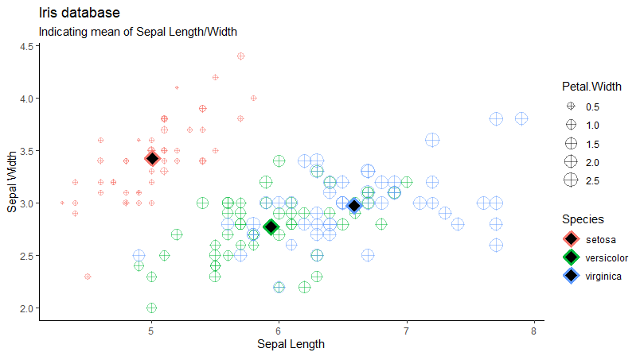

# RESULTADOS

#### Objetivo

- Conocer algunas de las bases de datos disponibles en `R`
- Observar algunas características y manipular los DataFrames con `dplyr`
- Realizar visualizaciones con `ggplot`
#### Requisitos

1. Tener instalado R y RStudio
2. Haber realizado el prework y estudiado los ejemplos de la sesión.

#### Desarrollo

1. Inspecciona el DataSet iris disponible directamente en la librería de ggplot.
Identifica las variables que contiene y su tipo, asegúrate de que no hayan datos faltantes y
que los datos se encuentran listos para usarse.
```
df <- iris
str(df)
sum(complete.cases(df))
```
R. 150 Observaciones y 150 completos

2. Crea una gráfica de puntos que contenga `Sepal.Lenght` en el eje horizontal,
`Sepal.Width` en el eje vertical, que identifique `Species` por color y que el tamaño
de la figura está representado por `Petal.Width`.
Asegúrate de que la geometría contenga `shape = 10` y `alpha = 0.5`.
```
library(ggplot2)
g <- ggplot(data=iris) +
  geom_point(aes(x=Sepal.Length, y = Sepal.Width, color = Species, size=Petal.Width), shape=10, alpha=0.5)
g
```

3. Crea una tabla llamada `iris_mean` que contenga el promedio de todas las variables
agrupadas por `Species`.
```
library(dplyr)
iris_mean <- iris %>%
  group_by(Species) %>%
  summarize(mean_Sepal_Length = mean(Sepal.Length),
            mean_Sepal_Width = mean(Sepal.Width),
            mean_Petal_Length = mean(Petal.Length),
            mean_Petal_Width = mean(Petal.Width))
head(iris_mean)
```


4. Con esta tabla, agrega a tu gráfica anterior otra geometría de puntos para agregar
los promedios en la visualización. Asegúrate que el primer argumento de la geometría
sea el nombre de tu tabla y que los parámetros sean `shape = 23`, `size = 4`,
`fill = 'black'` y `stroke = 2`. También agrega etiquetas, temas y los cambios
necesarios para mejorar tu visualización.
```
g <- g + geom_point(data = iris_mean, aes(x=mean_Sepal_Length, y = mean_Sepal_Width, color = Species, size=Petal.Width), shape = 23, size = 4, fill='black', stroke=2)
g
g <- g + labs(title = "Iris database",
              subtitle =  "Indicating mean of Sepal Length/Width",
              x = "Sepal Length",
              y = "Sepal Width") +
  theme_classic()
g
```

