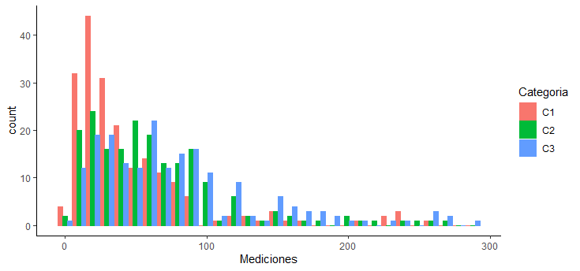
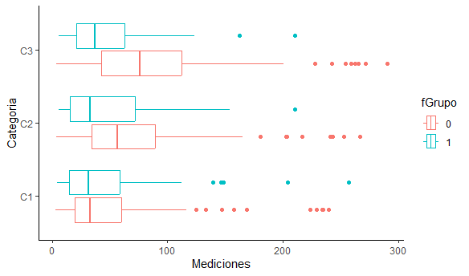

# RESULTADOS

#### Objetivo

- Realizar un análisis descriptivo de las variables de un dataframe

#### Requisitos

1. R, RStudio
2. Haber realizado el prework y seguir el curso de los ejemplos de la sesión
3. Curiosidad por investigar nuevos tópicos y funciones de R

#### Desarrollo

Utilizando el dataframe `boxp.csv` realiza el siguiente análisis descriptivo. No olvides excluir los missing values y transformar las variables a su
tipo y escala correspondiente.
```
df <- read.csv("https://raw.githubusercontent.com/beduExpert/Programacion-R-Santander-2022/main/Sesion-03/Data/boxp.csv")
View(df)
sum(complete.cases(df))
df.clean <- na.omit(df)
```

1. Calcula e interpreta las medidas de tendencia central de la variable `Mediciones`
```
> library(DescTools)
> mean(df.clean$Mediciones); median(df.clean$Mediciones);  Mode(df.clean$Mediciones)
[1] 62.88494
[1] 49.3
[1] 23.3
attr(,"freq")
[1] 6
```
> La media es 62.88; la mediana, 49.3, es menor que la media y la moda, 23.3 es menor que la mediana.

2. Con base en tu resultado anterior, ¿qué se puede concluir respecto al sesgo de `Mediciones`?
> Hay un sesgo a la derecha.

3. Calcula e interpreta la desviación estándar y los cuartiles de la distribución de `Mediciones`
```
> sd(df.clean$Mediciones)
[1] 53.76972
```
> Las mediciones tienen una dispersión promedio, respecto a la media, de 53.76972.
>
```
  > quantile(df.clean$Mediciones, probs = c(0.25, 0.50, 0.75))
  25%   50%   75%
  23.45 49.30 82.85
```
>- 25% de las observaciones tienen una medición de 23.45 o menos
> - 50% de las observaciones tienen una medición de 49.30 o menos
> - 75% de las observaciones tienen una medición de 82.85 o menos

4. Con ggplot, realiza un histograma
separando la distribución de `Mediciones` por `Categoría`
```
ggplot(df.clean, aes(x = Mediciones, color = Categoria, fill = Categoria)) +
    geom_histogram(position = "dodge") +
    theme_classic()
````

- ¿Consideras que sólo una categoría está generando el sesgo?"
> Parecería que la categoría C1 podría estar generando el sesgo, porque sobresalen algunas barras, pero la C2 y la C3 también presentan sesgo cada una de ellas.


5. Con ggplot, realiza un boxplot separando la distribución de `Mediciones` por `Categoría`
y por `Grupo` dentro de cada categoría.
```
df.clean$fGrupo <- factor(df.clean$Grupo)
ggplot(df.clean, aes(x=Mediciones, y=Categoria, color=fGrupo)) +
    geom_boxplot() +
    theme_classic()
```


- ¿Consideras que hay diferencias entre categorías?
> Si, en la categoría 1 los grupos se ven más parecidos entre si que en las categorías 2 y 3.

- ¿Los grupos al interior de cada categoría podrían estar generando el sesgo?
> Parece que el Grupo 1 podría estar generando el sesgo.
