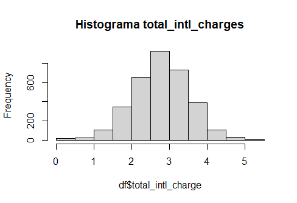
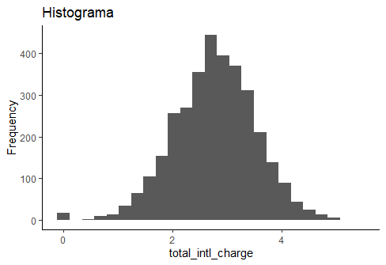
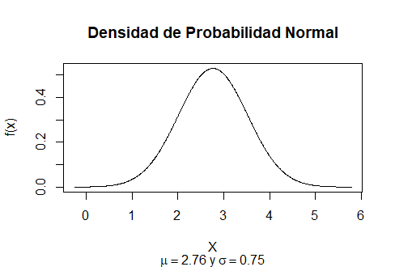

# Resultados

#### Objetivo
- Realizar un análisis probabilístico del total de cargos internacionales de una compañía de telecomunicaciones

#### Requisitos
- R, RStudio
- Haber trabajado con el prework y el work

#### Desarrollo
Utilizando la variable `total_intl_charge` de la base de datos telecom_service.csv de la sesión 3, realiza un análisis probabilístico. Para ello, debes determinar la función de distribución de probabilidad que más se  acerque el comportamiento de los datos. Hint: Puedes apoyarte de medidas descriptivas o técnicas de visualización.
```
df <- read.csv("https://raw.githubusercontent.com/beduExpert/Programacion-R-Santander-2022/main/Sesion-03/Data/telecom_service.csv")

value.mean <- mean(df$total_intl_charge)
value.median <- median(df$total_intl_charge)
value.sd = sd(df$total_intl_charge)
> value.mean
[1] 2.764581
> value.median
[1] 2.78
> value.sd
[1] 0.7537726
```
> La media (2.76) es menor que la mediana (2.78).   
Significa que más del 50% de los datos están por encima de la media, por lo que está más "abultada" hacia la izquierda.`

```
> library(moments)
> skewness(df$total_intl_charge)
[1] -0.2451761
```  

> Esta función confirma el sesgo a la izquierda

> (s > 0 Sesgo a la derecha, s = 0 Simétrica, s < 0 Sesgo a la izquierda)

```
> kurtosis(df$total_intl_charge)
[1] 3.606897
```
> Esta función indica que es leptocúrtica

> (Leptocúrtica k > 3, Mesocúrtica k = 3 (normal), Platocúrtica k < 3)
>

```
hist(df$total_intl_charge, main = "Histograma total_intl_charges")

library(ggplot2)
ggplot(df, aes(total_intl_charge)) +
  geom_histogram(bins=25) +
  labs(title = "Histograma",
       x = "Ingreso",
       y = "Frequency") +
  theme_classic()
```


> Las gráficas muestran que el sesgo a la izquierda es ligero y aunque es leptocúrtica presenta una forma cercana a la distribución normal.

Una vez que hayas seleccionado el modelo, realiza lo siguiente:
##### 1. Grafica la distribución teórica de la variable aleatoria `total_intl_charge`
```
x <- seq(-4, 4, 0.01)*value.sd + value.mean
y <- dnorm(x, mean = value.mean, sd = value.sd)
plot(x, y, type = "l", xlab = "X", ylab = "f(x)",
     main = "Densidad de Probabilidad",
     sub = expression(paste(mu == 2.76, " y ", sigma == 0.75)))
```

##### 2. ¿Cuál es la probabilidad de que el total de cargos internacionales sea menor a 1.85 usd?
```
> pnorm(1.85, mean = value.mean, sd = value.sd)
[1] 0.1125002
```
##### 3. ¿Cuál es la probabilidad de que el total de cargos internacionales sea # mayor a 3 usd?
```
> pnorm(3.0, mean = value.mean, sd = value.sd, lower.tail = FALSE)
[1] 0.3773985
```
##### 4. ¿Cuál es la probabilidad de que el total de cargos internacionales esté entre 2.35usd y 4.85 usd?
```
> pnorm(4.85, mean = value.mean, sd = value.sd) - pnorm(2.35, mean = value.mean, sd = value.sd)
[1] 0.7060114
```
##### 5. Con una probabilidad de 0.48, ¿cuál es el total de cargos internacionales más alto que podría esperar?
```
> qnorm(0.48, mean = value.mean, sd = value.sd, lower.tail = FALSE)
[1] 2.802386
```
##### 6. ¿Cuáles son los valores del total de cargos internacionales que dejan exactamente al centro el 80% de probabilidad?
```
> qnorm(p = 0.10, mean = value.mean, sd = value.sd)
[1] 1.798583
> qnorm(p = 0.10, mean = value.mean, sd = value.sd, lower.tail = FALSE)
[1] 3.73058
```
