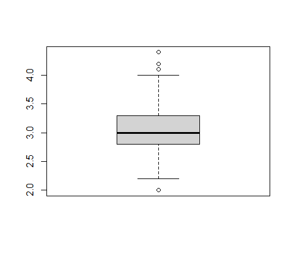
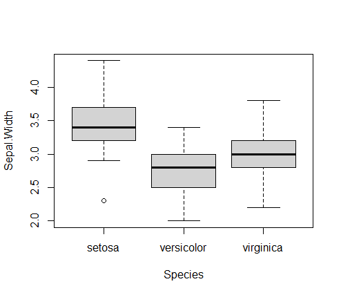

# Resultados

#### OBJETIVO
- Realizar inferencia estadística para extraer información de la muestra que sea contrastable con la población

####  REQUISITOS
- Haber desarrollado los postworks anteriores
- Cubrir los temas del prework
- Replicar los ejemplos de la sesión

####  DESARROLLO
El data frame iris contiene información recolectada por Anderson sobre 50 flores de 3 especies distintas (setosa, versicolor y virginca), incluyendo medidas en centímetros del largo y ancho del sépalo así como de los pétalos.
 
Estudios recientes sobre las mismas especies muestran que:
   
- i. En promedio, el largo del sépalo de la especie setosa (Sepal.Length) es igual a 5.7 cm
- ii. En promedio, el ancho del pétalo de la especie virginica (Petal.Width) es menor a 2.1 cm
- iii. En promedio, el largo del pétalo de la especie virgínica es 1.1 cm más grande que el promedio del largo del pétalo de la especie versicolor.
- iv. En promedio, no existe diferencia en el ancho del sépalo entre las 3 especies.

Utilizando pruebas de inferencia estadística, concluye si existe evidencia suficiente para concluir que los datos recolectados por Anderson están en línea con los nuevos estudios.
 
Utiliza 99% de confianza para toda las pruebas, en cada caso realiza el planteamiento de hipótesis adecuado y concluye.

---

##### i. En promedio, el largo del sépalo de la especie setosa (Sepal.Length) es igual a 5.7 cm

> Hipótesis 
</br> Para la especie setosa:
</br> Ho: Sepal.Length = 5.7
</br> Ha: Sepal.Length != 5.7
```
# Prueba
t.test(x = iris[iris$Species == 'setosa', "Sepal.Length"], alternative = 'two.sided', mu = 5.7, conf.level = 0.99)

# Resultado
One Sample t-test
data:  iris[iris$Species == "setosa", "Sepal.Length"]
t = -13.922, df = 49, p-value < 2.2e-16
alternative hypothesis: true mean is not equal to 5.7
99 percent confidence interval:
 4.872406 5.139594
sample estimates:
mean of x 
    5.006 
```
> Conclusión:
</br> Considerando un nivel de confianza de 99% (0.01 de significancia) y que la prueba t arroja un valor p de 2.2e-16, menor que el nivel de significancia,
existe evidencia estadística para rechazar Ho.
</br> Para el dataset Iris de Anderson el promedio del largo del sépalo de la especie setosa es distinto a 5.7


##### ii. En promedio, el ancho del pétalo de la especie virginica (Petal.Width) es menor a 2.1 cm
> Hipótesis 
</br> Para la especie virginica
</br> Ho: Petal.width >= 2.1
</br> Ha: Petal.width <  2.1
```
# Prueba
t.test(x = iris[iris$Species == 'virginica', "Petal.Width"], alternative = 'less', mu = 2.1, conf.level = 0.99)

# Resultado
One Sample t-test

data:  iris[iris$Species == "virginica", "Petal.Width"]
t = -1.9052, df = 49, p-value = 0.03132
alternative hypothesis: true mean is less than 2.1
99 percent confidence interval:
     -Inf 2.119409
sample estimates:
mean of x 
    2.026 
```

> Conclusión:
</br> Considerando un nivel de confianza de 99% (0.01 de significancia) y que la prueba t arroja un valor p de 0.03132, mayor al nivel de significancia, no existe evidencia estadística para rechazar Ho.
</br> Para el dataset Iris de Anderson el promedio del ancho del pétalo de la especie virginica no es menor de 2.1

##### iii. En promedio, el largo del pétalo de la especie virgínica es 1.1 cm más grande que el promedio del largo del pétalo de la especie versicolor.
> Hipótesis
</br> Ho: virginica.Petal.Length <= versicolor.Petal.Length + 1.1
</br> Ha: virginica.Petal.Length > versicolor.Petal.Length + 1.1

> Prueba de varianzas
</br> Ho: la tasa de varianzas (ratio)  = 1  (las varianzas son iguales)
</br> Ha: la tasa de varianzas (ratio) != 1  (las varianzas son distintas)

```
# Prueba
var.test(iris[iris$Species == "virginica", "Petal.Length"],
         iris[iris$Species == "versicolor", "Petal.Length"],
         ratio = 1, alternative = "two.sided", conf.level = 0.99)

# Resultado
F test to compare two variances

data:  iris[iris$Species == "virginica", "Petal.Length"] and iris[iris$Species == "versicolor", "Petal.Length"]
F = 1.3794, num df = 49, denom df = 49, p-value =
0.2637
alternative hypothesis: true ratio of variances is not equal to 1
99 percent confidence interval:
 0.6527879 2.9146771
sample estimates:
ratio of variances 
          1.379372 
```

> Conclusión sobre las varianzas:
</br> Considerando un nivel de confianza de 99% (0.01 de significancia) y que la prueba t arroja un valor p de 0.2637, mayor al de la significancia, no existe evidencia estadística para rechazar Ho.
</br> Las varianzas no son distintas

```
# Prueba
t.test(x = iris[iris$Species == "virginica", "Petal.Length"],
       y = iris[iris$Species == "versicolor", "Petal.Length"],
       alternative = "greater", mu = 1.1, var.equal = TRUE, conf.level = 0.99)

# Resultado
Two Sample t-test

data:  iris[iris$Species == "virginica", "Petal.Length"] and iris[iris$Species == "versicolor", "Petal.Length"]
t = 1.873, df = 98, p-value = 0.03202
alternative hypothesis: true difference in means is greater than 1.1
99 percent confidence interval:
 1.049566      Inf
sample estimates:
mean of x mean of y 
    5.552     4.260 
```

> Conclusión:
</br> Considerando un nivel de confianza de 99% (0.01 de significancia) y que la prueba t arroja un valor p de 0.03202, mayor al nivel de significancia, no existe evidencia estadística para rechazar Ho.
</br> El promedio del largo del pétalo de la especie virginica no es 1.1cm más grande que el promedio del largo del pétalo de la especie versicolor

##### iv. En promedio, no existe diferencia en el ancho del sépalo entre las 3 especies.
> Hipótesis
</br> Ho: Avg.virginica.Sepal.Width = Avg.versicolor.Sepal.Width = Avg.setosa.Sepal.Width
</br>  Ha: El promedio del ancho del sépalo de al menos una de las especies es distinto

```
# Visualización de datos
boxplot(iris$Sepal.Width)
boxplot(Sepal.Width ~ Species,
        data = iris)
```



```
# Prueba
anova <- aov(Sepal.Width ~ Species,
             data = iris)

# Resultados
> summary(anova)
             Df Sum Sq Mean Sq F value Pr(>F)    
Species       2  11.35   5.672   49.16 <2e-16 ***
Residuals   147  16.96   0.115                   
---
Signif. codes:  
0 ‘***’ 0.001 ‘**’ 0.01 ‘*’ 0.05 ‘.’ 0.1 ‘ ’ 1
```

> Conclusión:
</br> Considerando un nivel de confianza de 99% (0.01 de significancia) y que la prueba de análisis de varianza arroja un valor p <2e-16, menor al nivel de significancia, existe evidencia estadística para rechazar Ho.
</br> El promedio del ancho del sépalo de al menos una de las especies no es igual al promedio de otra especie


##### CONCLUSIÓN
> De acuerdo con las conclusiones de los 4 incisos anteriores, existe evidencia estadística para concluir que los datos recolectados por Anderson no están en 
línea con los nuevos estudios. 
