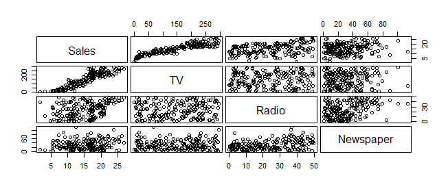
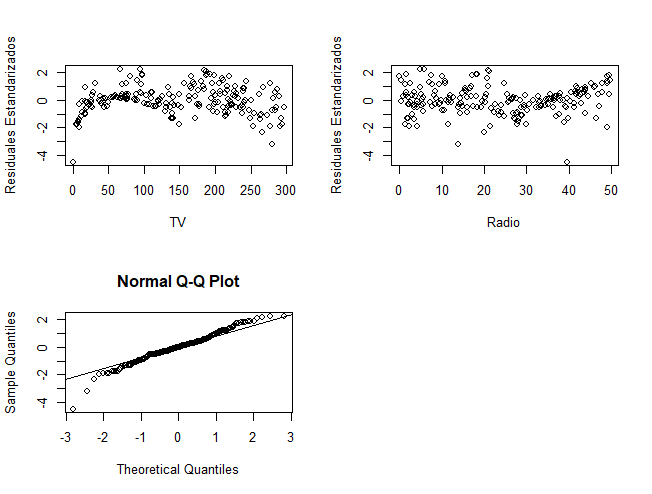

# Resultados
#### OBJETIVO
Supongamos que nuestro trabajo consiste en aconsejar a un cliente sobre como mejorar las ventas de un producto particular, y el conjunto de datos con el que disponemos son datos de publicidad que consisten en las ventas de aquel producto en 200 diferentes mercados, junto con presupuestos de publicidad para el producto en cada uno de aquellos mercados para tres medios de comunicación diferentes: TV, radio, y periódico. No es posible para nuestro cliente incrementar directamente las ventas del producto. Por otro lado, ellos pueden controlar el gasto en publicidad para cada uno de los tres medios de comunicación. Por lo tanto, si determinamos que hay una asociación entre publicidad y ventas, entonces podemos instruir a nuestro cliente para que ajuste los presupuestos de publicidad, y así indirectamente incrementar las ventas.

En otras palabras, nuestro objetivo es desarrollar un modelo preciso que pueda ser usado para predecir las ventas sobre la base de los tres presupuestos de medios de comunicación. Ajuste modelos de regresión lineal múltiple a los datos advertisement.csv y elija el modelo más adecuado siguiendo los procedimientos vistos.
 
Considera:
  
- Y: Sales (Ventas de un producto)
- X1: TV (Presupuesto de publicidad en TV para el producto)
- X2: Radio (Presupuesto de publicidad en Radio para el producto)
- X3: Newspaper (Presupuesto de publicidad en Periódico para el producto)

- [-> Ver archivo CSV de datos](https://github.com/adavals/bedu-datascience-f2/blob/main/s6/postwork/dat/telecom_service.csv)

```
adv <- read.csv("https://raw.githubusercontent.com/beduExpert/Programacion-R-Santander-2022/main/Sesion-06/data/advertising.csv")

# Visualización de los datos
head(adv)

# Matriz de correlación
round(cor(adv),4) 

# Resultado
              TV  Radio Newspaper  Sales
TV        1.0000 0.0548    0.0566 0.9012
Radio     0.0548 1.0000    0.3541 0.3496
Newspaper 0.0566 0.3541    1.0000 0.1580
Sales     0.9012 0.3496    0.1580 1.0000

# Gráfica de dispersión de la matriz de correlación
pairs(~ Sales + TV + Radio + Newspaper, 
      data = adv, gap = 0.4, cex.labels = 1.5)
```


```
# MODELO 1
# Estimación por Mínimos Cuadrados Ordinarios (OLS)
# Y_Sales = beta0 + beta1*TV + beta2*Radio + beta3*Newspaper + e

attach(adv)
m1 <- lm(Sales ~ TV + Radio + Newspaper)
summary(m1)

# Resultado
Call:
lm(formula = Sales ~ TV + Radio + Newspaper)

Residuals:
    Min      1Q  Median      3Q     Max 
-7.3034 -0.8244 -0.0008  0.8976  3.7473 

Coefficients:
             Estimate Std. Error t value Pr(>|t|)    
(Intercept) 4.6251241  0.3075012  15.041   <2e-16 ***
TV          0.0544458  0.0013752  39.592   <2e-16 ***
Radio       0.1070012  0.0084896  12.604   <2e-16 ***
Newspaper   0.0003357  0.0057881   0.058    0.954    
---
Signif. codes:  
0 ‘***’ 0.001 ‘**’ 0.01 ‘*’ 0.05 ‘.’ 0.1 ‘ ’ 1

Residual standard error: 1.662 on 196 degrees of freedom
Multiple R-squared:  0.9026,	Adjusted R-squared:  0.9011 
F-statistic: 605.4 on 3 and 196 DF,  p-value: < 2.2e-16
```

> De acuerdo con R cuadrada, el modelo explica en 90.11% los cambios en Sales.
</br>De estos resultados también se puede concluir que la variable Newspaper no es significativa, por lo que se probará el modelo sin la variable Newspaper:
</br>Y_Sales = beta0 + beta1*TV + beta2*Radio + e

```
# MODELO 2
m2 <- lm(Sales ~ TV + Radio)
summary(m2)

# Resultado
Call:
lm(formula = Sales ~ TV + Radio)

Residuals:
    Min      1Q  Median      3Q     Max 
-7.3131 -0.8269  0.0095  0.9022  3.7484 

Coefficients:
            Estimate Std. Error t value Pr(>|t|)    
(Intercept) 4.630879   0.290308   15.95   <2e-16 ***
TV          0.054449   0.001371   39.73   <2e-16 ***
Radio       0.107175   0.007926   13.52   <2e-16 ***
---
Signif. codes:  0 ‘***’ 0.001 ‘**’ 0.01 ‘*’ 0.05 ‘.’ 0.1 ‘ ’ 1

Residual standard error: 1.657 on 197 degrees of freedom
Multiple R-squared:  0.9026,	Adjusted R-squared:  0.9016 
F-statistic: 912.7 on 2 and 197 DF,  p-value: < 2.2e-16
```
> De acuerdo con R cuadrada, el modelo explica en 90.16% los cambios en Sales, un poco más alto que en m1

> Validación del modelo
1. El término de error no tiene correlación significativa con las variables 

```
StanRes2 <- rstandard(m2)
par(mfrow = c(2, 2))
plot(TV, StanRes2, ylab = "Residuales Estandarizados")
plot(Radio, StanRes2, ylab = "Residuales Estandarizados")
qqnorm(StanRes2)
qqline(StanRes2)
dev.off()
```


> Se observa que los residuales estandarizados no tienen una correlación significativa con las variables

2. El término de error sigue una distribución normal
```
shapiro.test(StanRes2)

# Resultado
Shapiro-Wilk normality test

data:  StanRes2
W = 0.97535, p-value = 0.001365
```
> De acuerdo con el valor de W, 0.97535, la distribución de los residuales estandarizados es cercana a 1, por lo que si se acerca a la distribución normal.

> Una vez validados estos supuestos, podemos utilizar nuestro modelo estimado para realizar predicciones y obtener su intervalo de confianza.

```
# Datos de ejemplo para predicción de ventas
data <- data.frame(
  TV = c(250.0, 300.0, 350.0, 400.0, 500.0),
  Radio = c(60.0, 80.0, 100.0, 120.0, 140.0)
)

predict(m2, newdata = data, interval = "confidence", level = 0.95)

# Resultado:
       fit      lwr      upr
1 24.67359 24.00797 25.33922
2 29.53953 28.55435 30.52471
3 34.40547 33.09367 35.71727
4 39.27141 37.63014 40.91269
5 46.85980 44.83446 48.88514
```
> Tomando como ejemplo el caso de designar un presupuesto de TV de $500 y uno de Radio de $140 el modelo predice un valor para Sales de $46.8598, el intervalo del 95% de confianza asociado con estos presupuestos estima un mínimo de ventas de 44.83 y un máximo de 44.88.

### [Ver código fuente R](https://github.com/adavals/bedu-datascience-f2/blob/main/s6/postwork/src/Sesion_06_Postwork.R)