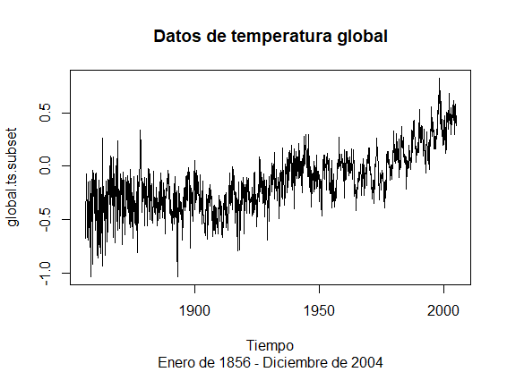
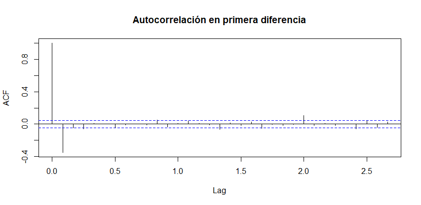
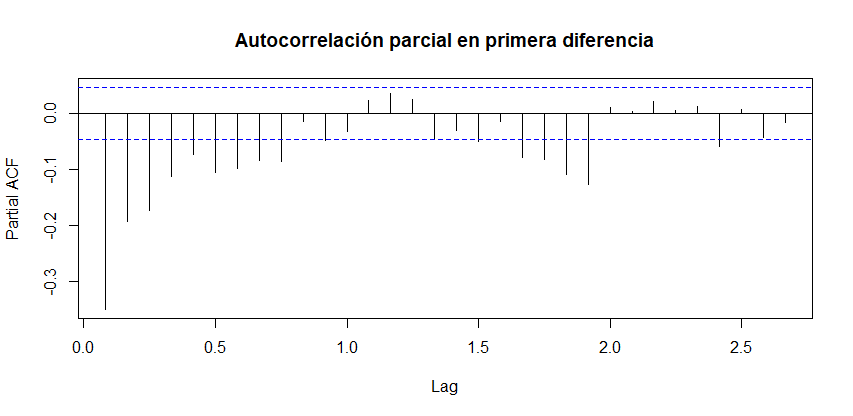

# Resultados
#### OBJETIVO
Predicciones de la temperatura global: Estimar modelos ARIMA y realizar predicciones.
#### DESARROLLO 
Utilizando el siguiente vector numérico, realiza lo que se indica.
```
url = "https://raw.githubusercontent.com/beduExpert/Programacion-R-Santander-2022/main/Sesion-07/Data/global.txt"
Global <- scan(url, sep="") 
```  
1. Crea una objeto de serie de tiempo con los datos
de Global. La serie debe ser mensual comenzado en Enero de 1856.
```
global.ts <- ts(Global, start = c(1856, 1), frequency = 12)

# visualizando el primer año de la serie
window(global.ts, start = 1856, end = c(1856,12)) 
        Jan    Feb    Mar    Apr    May    Jun    Jul    Aug    Sep    Oct    Nov    Dec
1856 -0.384 -0.457 -0.673 -0.344 -0.311 -0.071 -0.246 -0.235 -0.380 -0.418 -0.670 -0.386
```

2. Realiza una gráfica de la serie de tiempo anterior de 2005.
```  
global.ts.subset <- window(global.ts, end = 2004)
  
plot(global.ts.subset, 
    main = "Datos de temperatura global", 
    xlab = "Tiempo",
    sub = "Enero de 1856 - Diciembre de 2004")  
```
 

3. Ahora realiza una gráfica de la serie de tiempo anterior, transformando a la primera diferencia:
```
plot(diff(global.ts.subset), 
    main = "Datos de temperatura global", 
    xlab = "Tiempo",
    sub = "Enero de 1856 - Diciembre de 2004")  
```
plotTemperaturaGlobal1aDiff
 

4. ¿Consideras que la serie es estacionaria en niveles o en primera diferencia?

- `En primera diferencia`
  
5. Con base en tu respuesta anterior, obten las funciones de autocorrelación y autocorrelación parcial?
```  
acf(diff(global.ts.subset), main = "")
title(main = "Autocorrelación en primera diferencia")
```
 
```
pacf(diff(global.ts.subset), main = "")
title(main = "Autocorrelación parcial en primera diferencia")
```
 