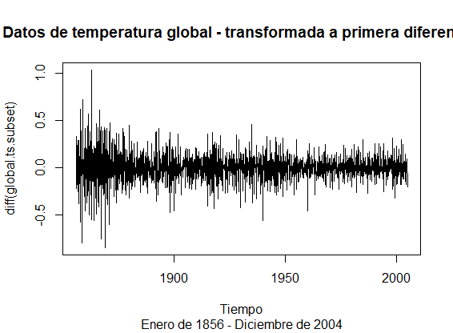

# Resultados
#### OBJETIVO
Predicciones de la temperatura global: Estimar modelos ARIMA y realizar predicciones.
#### DESARROLLO 
Utilizando el siguiente vector numérico, realiza lo que se indica.
```
url = "https://raw.githubusercontent.com/beduExpert/Programacion-R-Santander-2022/main/Sesion-07/Data/global.txt"
Global <- scan(url, sep="") 
```  
1. Crea una objeto de serie de tiempo con los datos
de Global. La serie debe ser mensual comenzado en Enero de 1856.
```
global.ts <- ts(Global, start = c(1856, 1), frequency = 12)

# visualizando el primer año de la serie
window(global.ts, start = 1856, end = c(1856,12)) 
        Jan    Feb    Mar    Apr    May    Jun    Jul    Aug    Sep    Oct    Nov    Dec
1856 -0.384 -0.457 -0.673 -0.344 -0.311 -0.071 -0.246 -0.235 -0.380 -0.418 -0.670 -0.386
```

2. Realiza una gráfica de la serie de tiempo anterior de 2005.
```  
global.ts.subset <- window(global.ts, end = c(2004,12))
  
plot(global.ts.subset, 
    main = "Datos de temperatura global", 
    xlab = "Tiempo",
    sub = "Enero de 1856 - Diciembre de 2004")  
```
 

3. Ahora realiza una gráfica de la serie de tiempo anterior, transformando a la primera diferencia:
```
plot(diff(global.ts.subset), 
    main = "Datos de temperatura global - transformada a primera diferencia", 
    xlab = "Tiempo",
    sub = "Enero de 1856 - Diciembre de 2004")  
```
plotTemperaturaGlobal1aDiff
 

4. ¿Consideras que la serie es estacionaria en niveles o en primera diferencia?

- `En primera diferencia`
  
5. Con base en tu respuesta anterior, obten las funciones de autocorrelación y autocorrelación parcial?
```  
acf(diff(global.ts.subset), main = "")
title(main = "Autocorrelación en primera diferencia")
```
 
```
pacf(diff(global.ts.subset), main = "")
title(main = "Autocorrelación parcial en primera diferencia")
```
 

6. De acuerdo con lo observado en las gráficas anteriores, se sugiere un modelo ARIMA
con AR(1), I(1) y MA desde 1 a 4 rezagos. 
</br>Estima los diferentes modelos ARIMA propuestos:
```
arima(Global.ts, order = c(1, 1, 1))

Call:
arima(x = global.ts.subset, order = c(1, 1, 1))

Coefficients:
         ar1      ma1
      0.3798  -0.8697
s.e.  0.0434   0.0294

sigma^2 estimated as 0.01651:  log likelihood = 1130.87,  aic = -2255.74
```
```
arima(Global.ts, order = c(1, 1, 2))
Call:
arima(x = global.ts.subset, order = c(1, 1, 2))

Coefficients:
         ar1      ma1     ma2
      0.7595  -1.2990  0.3186
s.e.  0.0354   0.0488  0.0453

sigma^2 estimated as 0.01622:  log likelihood = 1146.02,  aic = -2284.03
```
```
arima(Global.ts, order = c(1, 1, 3))
Call:
arima(x = global.ts.subset, order = c(1, 1, 3))

Coefficients:
         ar1      ma1     ma2     ma3
      0.8184  -1.3528  0.3082  0.0589
s.e.  0.0404   0.0489  0.0407  0.0327

sigma^2 estimated as 0.0162:  log likelihood = 1147.54,  aic = -2285.09
```
```
arima(Global.ts, order = c(1, 1, 4))

Call:
arima(x = global.ts.subset, order = c(1, 1, 4))

Coefficients:
         ar1      ma1     ma2     ma3     ma4
      0.8721  -1.4035  0.3446  0.0085  0.0602
s.e.  0.0327   0.0405  0.0437  0.0403  0.0272

sigma^2 estimated as 0.01616:  log likelihood = 1149.76,  aic = -2287.52
```
 
7. Con base en el criterio de Akaike, estima el mejor modelo ARIMA y realiza una 
predicción de 12 periodos (meses)
```
fit <- arima(global.ts.subset, order = c(1, 1, 4))
pr <- predict(fit, 12)$pred 

> pr
          Jan       Feb       Mar       Apr       May       Jun       Jul       Aug       Sep       Oct       Nov       Dec
2005 0.4261515 0.4255704 0.4320013 0.4303828 0.4289712 0.4277401 0.4266664 0.4257300 0.4249134 0.4242012 0.4235800 0.4230383
```
