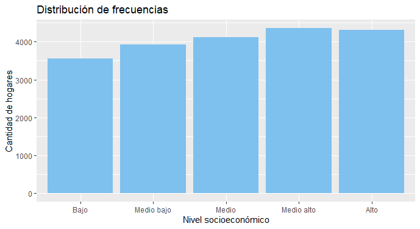
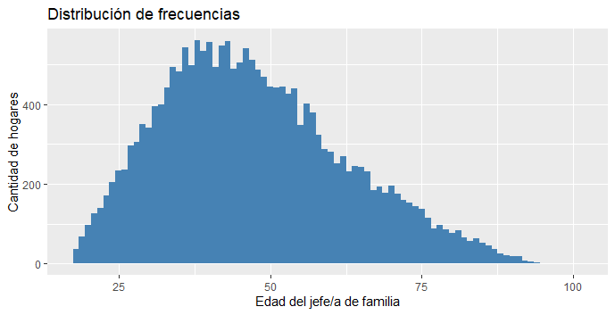
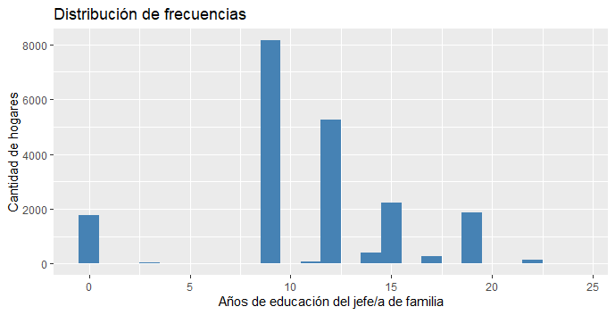
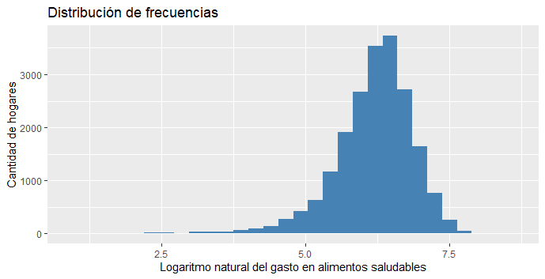
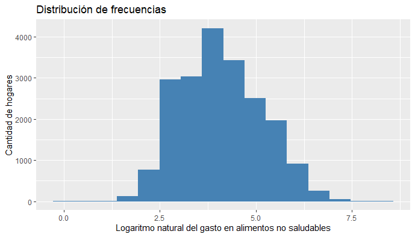

bbbb# Análisis estadístico sobre inseguridad alimentaria en México
## Introducción
En este trabajo, de acuerdo con el interés de un centro de salud nutricional en México,
el objetivo es realizar un análisis estadístico sobre los patrones de gasto en el hogar de alimentos saludables y no
saludables, determinar si los hogares con menor nivel socioeconomico tienden a gastar más 
en productos no saludables que los hogares con mayores niveles socioeconómicos y que esto,
podría llevarlos a presentar cierta inseguridad alimentaria y tratar de modelar 
los determinantes socioeconómicos de la inseguridad alimentaria, todo esto, usando un extracto de 
los datos de la Encuesta Nacional de Salud y Nutrición (2012) 

## Planteamiento del problema
Primeramente, se requiere un análisis estadístico para conocer sobre los 
patrones de gasto en alimentos saludables y no saludables en los hogares mexicanos, en base a:
- nivel socioeconómico, 
- si el hogar cuenta o no con recursos financieros extras
- si presenta o no inseguridad alimentaria. 

Enseguida, se busca entender el problema confirmando o descartando que los hogares con 
menor nivel socioeconómico tienden a gastar más en productos no saludables que los hogares con 
mayores niveles socioeconómicos y que esto, entre otros determinantes, lleva a que un hogar presente 
cierta inseguridad alimentaria.

Finalmente, se estima un modelo buscando identificar los determinantes socioeconómicos 
de la inseguridad alimentaria.

## Análisis descriptivo de la información

En este trabajo se usa un extracto de los datos de la Encuesta Nacional de Salud y Nutrición (2012),
levantada por el Instituto Nacional de Salud Pública en México. 
[-> Ver archivo CSV de datos](https://github.com/adavals/bedu-datascience-f2/blob/main/s8/postwork/dat/inseguridad_alimentaria_bedu.csv)

### Contenido de la base de datos
Cada registro está asociado con la información de un hogar respecto a:

| Variable | | Cualitativa | Cuantitativa |
| --- | --- | --- | --- |
| nse5f | Nivel socioeconómico del hogar: : 1 "Bajo", 2 "Medio bajo", 3 "Medio", 4 "Medio alto", 5 "Alto" | Ordinal |
| area | Zona geográfica: 0 "Zona urbana", 1 "Zona rural" | Nominal
| numpeho | Número de personas en el hogar | | Discreta
| refin | Recursos financieros distintos al ingreso laboral: 0 "no", 1 "sí" | Nominal
| edadjef | Edad del jefe/a de familia | | Discreta
| sexojef | Sexo del jefe/a de familia): 0 "Hombre", 1 "Mujer" | Nominal
| añosedu | Años de educación del jefe de familia | | Discreta
| ln_als | Logaritmo natural del gasto en alimentos saludables | | Contínua 
| ln_alns | Logaritmo natural del gasto en alimentos no saludables | | Contínua
| IA | Inseguridad alimentaria en el hogar: 0 "No presenta IA", 1 "Presenta IA" | Nominal

### Estado de los datos
Al visualizar los datos se detectó que, en total, el 50% de los registros tiene en alguno de sus campos el valor NA (No disponible), y los campos que presentan no disponiblilidad son los siguientes:
| Campo | % de registros con NA
| --- | ---
| ln_alns: gasto en alimentos no saludables |  42%
| ln_als:  gasto en alimentos saludables    |  19%
| edadjef: edad del jefe/a de familia       |  12%
| sexojef: sexo del jefe/a de familia |  12%

Se decidió eliminar del conjunto de datos todos los registros con algún campo con valor NA, debido a que se desconocen las razones por las que no están disponibles estos datos, no se cuenta con información adicional sobre inseguridad alimentaria y de conocimiento técnico suficiente para darle un tratamiento adecuado a estos datos faltantes.

Los resultados de este trabajo pueden estar afectados de manera muy importante debido a esta eliminación, principalmente cuando se involucra la variable de gasto en alimentos no saludables y la inseguridad alimentaria. En estos registros eliminados, los valores de la variable inseguridad alimentaria que se presentan son:

|No presenta IA|Presenta IA 
| --- | ---
3,938 (22.5%) | 13,566 (77.5%)

Se está eliminando una mayor cantidad de información que estaría describiendo las condiciones en las que se presenta la inseguridad alimentaria.

### Análisis de frecuencias de variables cualitativas
Una vez realizada la limpieza de datos se cuenta con la siguiente información de frecuencias:

- nse5f (nivel socioeconomico): Presenta frecuencias cercanas entre los diferentes valores, entre 18% y 22% cada grupo socioeconómico.

| Valor | Frecuencia| Frecuencia Relativa | Frecuencia acumulada |
| --- | --- | --- | --- | 
|       Bajo| 3553 |0.1751972 |0.1751972
| Medio bajo |3927 |0.1936391 |0.3688363
|      Medio |4119 |0.2031065 |0.5719428
| Medio alto |4364 |0.2151874 |0.7871302
|       Alto |4317 |0.2128698 |1.0000000

- area (zona geográfica): El 68% de los hogares están en zona urbana y el 32% en zona rural.

- refin (recursos financieros adicionales al ingreso laboral): El 80% de los hogares si tiene, el 20% de los hogares no tiene.
  
- sexojef (sexo del jefe/a de familia): En el 78% de los hogares es hombre, en el 22% de los hogares es mujer.

- IA (inseguridad alimentaria en el hogar): El 71% de los hogares si presenta inseguridad alimentaria, el 29% no presenta IA. 

- numpeho (número de personas en el hogar): En el 83% de hogares viven entre 1 y 5.5 personas.

- edadjef (edad del jefe/a de familia): Aproximadamente en el 80% de los hogares el jefe de familia tiene entre 18 y 60 años.

- añosedu (años de educación del jefe/a de familia): Aproximadamente en el 75% de los hogares el jefe de familia tiene entre 0 y 12 años de educación

- ln_als (logaritmo natural del gasto en alimentos saludables): la mayor frecuencia se encuentra alrededor del valor 6.

- ln_alns (logaritmo natural del gasto en alimentos no saludables): la mayor frecuencia se encuentra alrededor del valor 4.

### Medidas de tendencia central, posición y dispersión
||Mínimo |1erQ |Mediana |Media | Desv. Est. |3erQ |Máximo |sesgo |curtosis
| --- | --- | --- | --- | --- | --- | --- | --- | --- | --- |
|numpeho|1|3|4|3.991|1.8559|5|19|derecha|leptocúrtica
|edadjef|18|36|46|47.32|15.1054|57|101|derecha|platocúrtica
|añosedu|0|9|12|10.9|4.6952|12|24|izquierda|leptocúrtica
|ln_als|1.099|5.844|6.274|6.192|0.688553|6.633|8.605|izquierda|leptocúrtica
|ln_alns|0.000|3.401|4.007|4.119|1.041476|4.868|8.298|derecha|platocúrtica

### Correlación

### Patrones de gasto en alimentos no saludables
boxplot? o alguna
(Gráfica Boxplot por Nivel Socioeconomico)
(Gráfica Boxplot por Recursos financieros)
(Gráfica boxplot por inseguridad alimentaria)

### Patrones de gasto en alimentos saludables
(Gráfica Boxplot por Nivel Socioeconomico)
(Gráfica Boxplot por Recursos financieros)
(Gráfica boxplot por inseguridad alimentaria)

## Cálculo de probabilidades
### Algo

## Planteamiento de hipótesis
###  Ho: El gasto en alimentos no saludables en los diferentes niveles socioeconómicos es igual
 Ha: El gasto en alimentos no saludables en al menos uno de los niveles socieconómicos difiere de algún otro nivel.

Ho: El gasto en alimentos no saludables es igual en los hogares que presentan inseguridad alimentaria que en los que no presentan inseguridad alimentaria
Ha: El gasto en alimentos no saludables es diferente en los hogares que presentan inseguridad alimentaria que en los que no presentan inseguridad alimentaria

## Estimación de modelo, para identificar los determinantes de la inseguridad alimentaria
Regresión logística

## Conclusión

