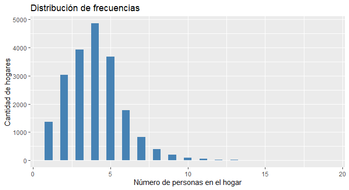
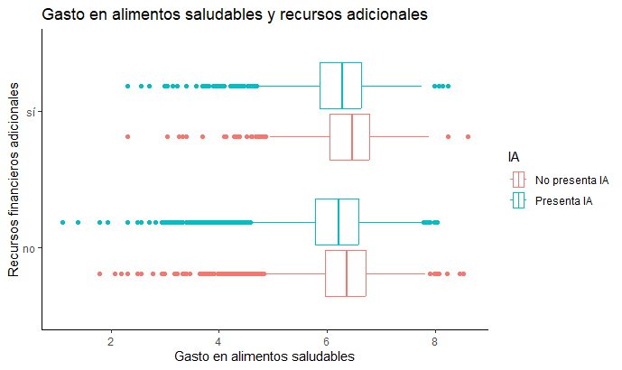

# Análisis estadístico sobre inseguridad alimentaria en México
### EQUIPO 17:
- Alan Canales
- Bernardo Arroyo
- Guadalupe Valenzuela Soto
- Hazael Cuahutli Román López
- José Antonio Jiménez Loya
- Martha Isabel Soriano Ruiz
---
## Introducción
De acuerdo con el interés de un centro de salud nutricional en México, en este trabajo se realiza un análisis estadístico sobre los patrones de gasto en el hogar de alimentos saludables y no saludables, determinar si los hogares con menor nivel socioeconomico tienden a gastar más 
en productos no saludables que los hogares con mayores niveles socioeconómicos y que esto,
podría llevarlos a presentar cierta inseguridad alimentaria y tratar de modelar 
los determinantes socioeconómicos de la inseguridad alimentaria, todo esto, usando un extracto de 
los datos de la Encuesta Nacional de Salud y Nutrición (2012) 

## Planteamiento del problema

Primeramente, se requiere un análisis estadístico para conocer sobre los 
patrones de gasto en alimentos saludables y no saludables en los hogares mexicanos, en base a:
- nivel socioeconómico, 
- si el hogar cuenta o no con recursos financieros extras
- si presenta o no inseguridad alimentaria. 

Enseguida, se busca entender el problema confirmando o descartando que los hogares con 
menor nivel socioeconómico tienden a gastar más en productos no saludables que los hogares con 
mayores niveles socioeconómicos y que esto, entre otros determinantes, lleva a que un hogar presente 
cierta inseguridad alimentaria.

Finalmente, se estima un modelo buscando identificar los determinantes socioeconómicos 
de la inseguridad alimentaria.

## Análisis descriptivo de la información

En este trabajo se usa un extracto de los datos de la Encuesta Nacional de Salud y Nutrición (2012),
levantada por el Instituto Nacional de Salud Pública en México. 
[-> Ver archivo CSV de datos](https://github.com/adavals/bedu-datascience-f2/blob/main/s8/postwork/dat/inseguridad_alimentaria_bedu.csv)

### Contenido de la base de datos
Cada registro está asociado con la información de un hogar respecto a:

| Variable | | Cualitativa | Cuantitativa |
| --- | --- | --- | --- |
| nse5f | Nivel socioeconómico del hogar: : 1 "Bajo", 2 "Medio bajo", 3 "Medio", 4 "Medio alto", 5 "Alto" | Ordinal |
| area | Zona geográfica: 0 "Zona urbana", 1 "Zona rural" | Nominal
| numpeho | Número de personas en el hogar | | Discreta
| refin | Recursos financieros distintos al ingreso laboral: 0 "no", 1 "sí" | Nominal
| edadjef | Edad del jefe/a de familia | | Discreta
| sexojef | Sexo del jefe/a de familia): 0 "Hombre", 1 "Mujer" | Nominal
| añosedu | Años de educación del jefe de familia | | Discreta
| ln_als | Logaritmo natural del gasto en alimentos saludables | | Contínua 
| ln_alns | Logaritmo natural del gasto en alimentos no saludables | | Contínua
| IA | Inseguridad alimentaria en el hogar: 0 "No presenta IA", 1 "Presenta IA" | Nominal

### Estado de los datos
Al visualizar los datos se detectó que, en total, el 50% de los registros tiene en alguno de sus campos el valor NA (No disponible), y los campos que presentan no disponiblilidad son los siguientes:
| Campo | % de registros con NA
| --- | ---
| ln_alns: gasto en alimentos no saludables |  42%
| ln_als:  gasto en alimentos saludables    |  19%
| edadjef: edad del jefe/a de familia       |  12%
| sexojef: sexo del jefe/a de familia |  12%

Se decidió eliminar del conjunto de datos todos los registros con algún campo con valor NA, debido a que se desconocen las razones por las que no están disponibles estos datos, no se cuenta con información adicional sobre inseguridad alimentaria y de conocimiento técnico suficiente para darle un tratamiento adecuado a estos datos faltantes.

Los resultados de este trabajo pueden estar afectados de manera muy importante debido a esta eliminación, principalmente cuando se involucra la variable de gasto en alimentos no saludables y la inseguridad alimentaria. En estos registros eliminados, los valores de la variable inseguridad alimentaria que se presentan son:

|No presenta IA|Presenta IA 
| --- | ---
3,938 (22.5%) | 13,566 (77.5%)

Se está eliminando una mayor cantidad de información que estaría describiendo las condiciones en las que se presenta la inseguridad alimentaria.

### Análisis de frecuencias de variables cualitativas
Una vez realizada la limpieza de datos se cuenta con la siguiente información de frecuencias:

- nse5f (nivel socioeconomico): Presenta frecuencias cercanas entre los diferentes valores, entre 18% y 22% cada grupo socioeconómico.

| Valor | Frecuencia| Frecuencia Relativa | Frecuencia acumulada |
| --- | --- | --- | --- | 
|       Bajo| 3553 |0.1751972 |0.1751972
| Medio bajo |3927 |0.1936391 |0.3688363
|      Medio |4119 |0.2031065 |0.5719428
| Medio alto |4364 |0.2151874 |0.7871302
|       Alto |4317 |0.2128698 |1.0000000

- area (zona geográfica): El 68% de los hogares están en zona urbana y el 32% en zona rural.

- refin (recursos financieros adicionales al ingreso laboral): El 80% de los hogares si tiene, el 20% de los hogares no tiene.
  
- sexojef (sexo del jefe/a de familia): En el 78% de los hogares es hombre, en el 22% de los hogares es mujer.

- IA (inseguridad alimentaria en el hogar): El 71% de los hogares si presenta inseguridad alimentaria, el 29% no presenta IA. 

- numpeho (número de personas en el hogar): En el 83% de hogares viven entre 1 y 5.5 personas.

- edadjef (edad del jefe/a de familia): Aproximadamente en el 80% de los hogares el jefe de familia tiene entre 18 y 60 años.

- añosedu (años de educación del jefe/a de familia): Aproximadamente en el 75% de los hogares el jefe de familia tiene entre 0 y 12 años de educación

- ln_als (logaritmo natural del gasto en alimentos saludables): la mayor frecuencia se encuentra alrededor del valor 6.

- ln_alns (logaritmo natural del gasto en alimentos no saludables): la mayor frecuencia se encuentra alrededor del valor 4.

### Medidas de tendencia central, posición y dispersión
||Mínimo |1erQ |Mediana |Media | Desv. Est. |3erQ |Máximo |sesgo |curtosis
| --- | --- | --- | --- | --- | --- | --- | --- | --- | --- |
|numpeho|1|3|4|3.991|1.8559|5|19|derecha|leptocúrtica
|edadjef|18|36|46|47.32|15.1054|57|101|derecha|platocúrtica
|añosedu|0|9|12|10.9|4.6952|12|24|izquierda|leptocúrtica
|ln_als|1.099|5.844|6.274|6.192|0.688553|6.633|8.605|izquierda|leptocúrtica
|ln_alns|0.000|3.401|4.007|4.119|1.041476|4.868|8.298|derecha|platocúrtica

Si aplicamos la función exponencial a los datos de gastos que están expresados como logaritmo natural tenemos que para:
- Gasto en alimentos saludables la media es 488.8187 y la desviación estándar es 1.990833.
- Gasto en alimentos no saludables la media es 61.48815 y la desviación estándar es 2.833395

Se observa que el gasto en alimentos no saludables presenta más variabilidad que el gasto en alimentos saludables

### Correlación de variables
Se obtuvo la siguiente tabla de correlación entre variables cuantitativas:
|        |numpeho |edadjef |añosedu  |ln_als |ln_alns
| --- | --- | --- | --- | --- | ---
|numpeho | 1.0000 
|edadjef |-0.1140 | 1.0000 
|añosedu |-0.0435 |-0.3566  |1.0000  
|ln_als  | 0.3109 |-0.1127  |0.2421  |1.0000  
|ln_alns | 0.0809 |-0.0984  |0.2184  |0.3285  |1.0000

En esta tabla se puede observar:
- Ninguna correlación entre variables se acerca a +-1 o al menos a +- .5, este conjunto de variables no presenta fuerte correlación
- El gasto en alimentos no saludables tiene la más alta correlación con el gasto en alimentos saludables.
- La edad del jefe de familia tiene la más alta correlación negativa con los años de educación del jefe de familia.

### Patrones de gasto en alimentos no saludables
Se obtuvo información sobre patrones de gasto en alimentos no saludables usando gráficas de caja. 

En la primera gráfica se observa que el gasto en alimentos no saludales entre los diferentes niveles socioeconómicos es mayor a medida que el nivel socioeconómico es más alto.

Enseguida, se involucró la variable de inseguridad alimentaria y se observa que en el nivel socioeconómico bajo, el grupo que presenta inseguridad alimentaria presenta muchos valores extremos en gasto en alimento no saludable.

Finalmente se obtuvo el mismo tipo de gráfico pero involucrando a la variable recursos financieros adicionales y también se observan valores extremos altos en gasto en alimento no saludable en el grupo que presenta inseguridad alimentaria.

### Patrones de gasto en alimentos saludables
En la primera gráfica se observa que el gasto en alimentos saludables entre los diferentes niveles socioeconómicos es mayor a medida que el nivel socioeconómico es más alto. Adicionalmente se observa una cantidad sobresaliente de valores extremos bajos, es decir, muchos hogares, en todos los niveles socioeconómicos presentan gastos extremadamente bajos en alimentos saludables. También presentan gastos extremos altos pero en menor cantidad que los bajos.

Enseguida, se involucró la variable de inseguridad alimentaria y se observó el mismo comportamiento de valores extremos muy similiar tanto en los grupos que presentan inseguridad alimentaria como los que no, aunque parece haber más valores extremos bajos en los grupos que presentan inseguridad alimentaria.

Finalmente se obtuvo el mismo tipo de gráfico pero involucrando a la variable recursos financieros adicionales y se observan más valores extremos bajos en gasto en alimento saludable en el grupo que presenta inseguridad alimentaria.

## Cálculo de probabilidades
En este apartado se obtuvieron formas gráficas de la densidad de probabilidad para las variables de gasto en alimentos saludables y gasto en alimentos no saludables y se calcularon algunas probabilidades respecto a estas variables.

### Densidad de probabilidad para gasto en alimentos saludables

### Densidad de probabilidad para gasto en alimentos no saludables

### Probabilidades
Se calcularon algunas probabilidades que pueden ayudar a comprender lo que ocurre con el gasto en alimentos no saludables.

1. ¿Cuál es la probabilidad de que el gasto en alimento no saludable sea mayor a un 50% del promedio del gasto en alimento saludable?
83.69%

2. ¿Hasta cuanto gastan en alimento no saludable el 90% de los  hogares?
233.58

3. ¿Cuál es el rango de gasto en alimento no saludable en el que se encuentra el 80% de los hogares?
El 80% de los hogares gasta entre 16.18 y 233.58 en alimentos no saludables

## Planteamiento de hipótesis
De acuerdo con la información disponible, la mayoría de las personas afirman que los hogares con menor nivel socioeconómico tienden a 
gastar más en productos no saludables que las personas con mayores niveles socioeconómicos.

En un primer paso para saber si los datos nos proporcionan evidencia estadística para confirmar esta afirmación, se organizó gráficamente el gasto en alimento no saludable agrupado por nivel socioeconómico.

Visualmente se puede notar que los promedios de gasto en alimentos no saludables son diferentes en cada nivel socioeconómico, incluso, se observa que el gasto es mayor a medida que el nivel socioeconómico es más alto y que hay una cantidad notable de valores atípicos altos en el nivel socioeconómico bajo.

Enseguida, mediante un contraste de hipótesis se determina si, de acuerdo con la evidencia estadística, hay alguna diferencia en el gasto promedio en alimentos no saludables entre los niveles socioeconómicos.

Para ello se empleó la prueba ANOVA de un factor para poder concluir si la variable gasto en alimentos no saludables se ve afectada por el factor nivel socioeconómico, con base en las siguientes hipótesis:

- Ho: La media del gasto en alimentos no saludables es igual en todos los niveles socioeconómicos.
- Ha: La media del gasto en alimentos no saludables difiere en al menos uno de los niveles respecto a los demás.

Resultado de la prueba

El resultado de la prueba ANOVA mostró un valor p cercano a 0, por lo que se rechaza Ho en favor de la hipóties alternativa.
También el resultado indica una

Con un nivel de confianza mayor al 99%, existe evidencia estadística para concluir que la media del gasto en alimentos no saludables difiere en al menos uno de los niveles respecto a los demás.

## Estimación de modelo para identificar los determinantes de la inseguridad alimentaria

El conocimiento sobre los datos que se ha generado hasta este punto, aunque limitado, permite establecer un punto de partida para estimar un modelo con las variables que determinan a la inseguridad alimentaria (IA): el comportamiento de la variable IA parece no depender principalmente de una sola variable en particular, por ejemplo, del gasto en alimentos no saludables, o del nivel socioeconómico bajo, más bien parece que su comportamiento es mejor descrito por un conjunto de variables.

Con base en esta idea se realizó una primera estimación, con un modelo de regresión logística incluyendo todas las variables disponibles.

De acuerdo con los valores p obtenidos con este modelo, todas las variables presentan significación o determinan en cierta medida el comportamiento de IA, pero se observa que las variables area y gasto en alimentos saludables tienen menor significación que el resto. 
El criterio de Akaike (AIC) sobre el desempeño de un modelo es de 22142. La bondad de ajuste del modelo arroja un valor de 0.0924, que indica baja variabilidad, por lo que se puede considerar un buen modelo.

Con un siguiente modelo, sin usar la variable area se observa que el criterio de Akaike (AIC) para determinar un mejor desempeño 
de modelo es 3 puntos mayor (22145), por lo que, al parecer incluir en el modelo todas las variables de la base de datos describe mejor el comportamiento de IA. Sin embargo, la bondad de ajuste del modelo arroja un valor de 0.0520, una variabilidad menor que en el modelo anterior, su bondad de ajuste es mejor que el anterior.

Ya que un modelo de regresión logística como el que se ha obtenido es útil para clasificar si un hogar presentaría IA o no, se utiliza el predictor del modelo para realizar esta clasificación. Para conseguirlo se establece un umbral de probabilidad a partir de la cual se considera que la variable pertenece a uno de los niveles (presenta IA o no presenta IA). 
En un primer ensayo se asignó 0.5 como umbral o valor límite. Esto es que, si la probabilidad de que la variable adquiera el valor 1 (presenta IA) es superior a 0.5 para la prueba, se asigna a este nivel "presenta IA".
En un segundo ensayo se asignó 0.7 como umbral.
De acuerdo con las matrices de confusión calculadas se obtiene una precisión más alta con umbral .5.

|umbral|precisión|
| --- | --- |
| .5  | .733
| .7  | .6731

Comparando gráficamente las matrices de confusión de ambos umbrales se puede observar la mejor precisión con el umbral .5.

Finalmente, cabe mencionar que los niveles de precisión podrían mejorar si se incluyen los registros incompletos eliminados del conjunto de datos, dándoles un tratamiento adecuado.

## Conclusiones
Con base en los análisis aplicados a los datos se logró un mayor conocimiento sobre el comportamiento de la inseguridad alimentaria en México.

De acuerdo con los procedimientos aplicados se concluye que el comportamiento de la inseguridad alimentaria se puede describir mejor a través de un conjunto de variables y no sólo de una o dos en particular.

La confiabilidad de los hallazgos y procedimientos empleados en este trabajo está condicionada por varios factores:
- la eliminación de los datos incompletos de la base de datos;
- falta de análisis individuales y más extensos de variables adicionales al nivel socioeconómico y el gasto en alimento no saludable;
- el tiempo limitado para realizarlo;
- y la experiencia y comprensión a nivel inicial en la aplicación de conceptos y uso de herramientas estadísticas.

Favorablemente, para todos los miembros del equipo se logró una mayor comprensión y experiencia en la aplicación de conceptos y herramientas estadísticas, así como el uso y ventajas del lenguaje R en el desarrollo de trabajos de análisis estadístico.

---
[-> Ver Código R](https://github.com/adavals/bedu-datascience-f2/tree/main/s8/postwork/src)

