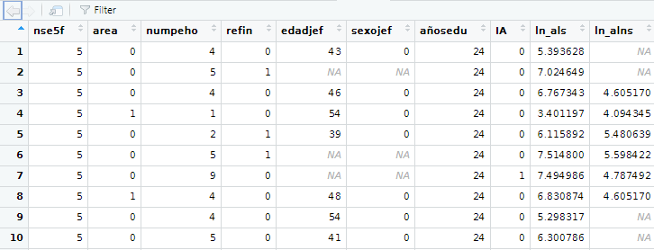

# RESULTADOS
## Requisitos 
- Haber realizado los works y postworks previos 
- Tener una cuenta en Github o en RStudioCloud 
## Desarrollo 
Un centro de salud nutricional está interesado en analizar estadísticamente y probabilísticamente los patrones de gasto en alimentos saludables y no saludables en los hogares mexicanos con base en su nivel socioeconómico, en si el hogar tiene recursos financieros extras al ingreso y en si presenta o no inseguridad alimentaria. Además, está interesado en un modelo que le permita identificar los determinantes socioeconómicos de la inseguridad alimentaria.

La base de datos es un extracto de la Encuesta Nacional de Salud y Nutrición (2012) levantada por el Instituto Nacional de Salud Pública en México. La mayoría de las personas afirman que los hogares con menor nivel socioeconómico tienden a gastar más en productos no saludables que las personas con mayores niveles socioeconómicos y que esto, entre otros determinantes, lleva a que un hogar presente cierta inseguridad alimentaria.

La base de datos contiene las siguientes variables:
- nse5f (Nivel socioeconómico del hogar): 1 "Bajo", 2 "Medio bajo", 3 "Medio", 4 "Medio alto", 5 "Alto" 
- area (Zona geográfica): 0 "Zona urbana", 1 "Zona rural"
- numpeho (Número de persona en el hogar) 
- refin (Recursos financieros distintos al ingreso laboral): 0 "no", 1 "sí" 
- edadjef (Edad del jefe/a de familia)
- sexojef (Sexo del jefe/a de familia): 0 "Hombre", 1 "Mujer" 
- añosedu (Años de educación del jefe de familia) 
- ln_als (Logaritmo natural del gasto en alimentos saludables) 
- ln_alns (Logaritmo natural del gasto en alimentos no saludables) 
- IA (Inseguridad alimentaria en el hogar): 0 "No presenta IA", 1 "Presenta IA"

```
df<-read.csv("https://raw.githubusercontent.com/beduExpert/Programacion-R-Santander-2022/main/Sesion-08/Postwork/inseguridad_alimentaria_bedu.csv")
```
[-> Ver archivo CSV de datos](https://github.com/adavals/bedu-datascience-f2/blob/main/s8/postwork/dat/inseguridad_alimentaria_bedu.csv)

### I. Plantea el problema del caso 

El objetivo de este trabajo es saber si es posible identificar los determinantes
socioeconómicos de la inseguridad alimentaria.

Con base en la información que maneja el centro nutricional se detectan las siguientes interrogantes que pueden guíar este trabajo:
  
1. ¿Cuáles son los patrones de gasto en alimentos saludables y no saludables en los hogares mexicanos considerando su nivel socioeconómico, si cuenta con recursos financieros extra y si presenta inseguridad alimentaria?
2. ¿Los hogares con menor nivel socioeconómico tienden a gastar más en productos no saludables que los hogares con mayores niveles socioeconómicos?  
3. ¿El que los hogares con menor nivel socioeconómico gasten más en productos no saludables los lleva a que presente inseguridad alimentaria?
4. ¿Es posible encontrar un modelo que permita identificar los determinantes socioeconómicos de la inseguridad alimentaria?


### II. Realiza un análisis descriptivo de la información 

- Preparación y limpieza de datos
```
df<-read.csv("https://raw.githubusercontent.com/beduExpert/Programacion-R-Santander-2022/main/Sesion-08/Postwork/inseguridad_alimentaria_bedu.csv")
dim(df)   
# 40809 observaciones y 10 variables

# Visualización de datos
View(df)
```

```
# Limpieza: Se eliminan observaciones incompletas
df.clean <- df[complete.cases(df),]
dim(df.clean)   
# 20280 observaciones completas y 10 variables
```

- Tipos de variables

| Variable | | Cualitativa | Cuantitativa |
| --- | --- | --- | --- |
| nse5f | Nivel socioeconómico del hogar: : 1 "Bajo", 2 "Medio bajo", 3 "Medio", 4 "Medio alto", 5 "Alto" | Ordinal |
| area | Zona geográfica: 0 "Zona urbana", 1 "Zona rural"1 | Nominal
| numpeho | Número de personas en el hogar | | Discreta
| refin | Recursos financieros distintos al ingreso laboral: 0 "no", 1 "sí" | Nominal
| edadjef | Edad del jefe/a de familia | | Discreta
| sexojef | Sexo del jefe/a de familia): 0 "Hombre", 1 "Mujer" | Nominal
| añosedu | Años de educación del jefe de familia | | Discreta
| ln_als | Logaritmo natural del gasto en alimentos saludables | | Contínua 
| ln_alns | Logaritmo natural del gasto en alimentos no saludables | | Contínua
| IA | Inseguridad alimentaria en el hogar: 0 "No presenta IA", 1 "Presenta IA" | Nominal

- Medidas de tendencia central
1. Cualitativas

| Variable | Mediana | Moda |
| --- | --- | --- |
| nse5f: 1 "Bajo", 2 "Medio bajo", 3 "Medio", 4 "Medio alto", 5 "Alto" | x | x
| area: 0 "Zona urbana", 1 "Zona rural"1 | x | x
| refin: 0 "no", 1 "sí" | x | x
| sexojef: 0 "Hombre", 1 "Mujer" | x | x
| IA: 0 "No presenta IA", 1 "Presenta IA" | x | x


2. Cuantitativas

| Variable | Media | Mediana | Moda |
| --- | --- | --- | --- |
| edadjef | x | x | x
| numpeho | x | x | x
| añosedu | x | x | x
| ln_als | x | x | - 
| ln_alns | x | x | -


### III. Calcula probabilidades que nos permitan entender el problema en México 


### IV. Plantea hipótesis estadísticas y concluye sobre ellas para entender el problema en México 

### V. Estima un modelo de regresión, lineal o logístico, para identificar los determinantes de la inseguridad alimentaria en México 

### VI. Escribe tu análisis en un archivo README.MD y tu código en un script de R y publica ambos en un repositorio de Github.
### [Análisis]### [Ver código fuente R](https://github.com/adavals/bedu-datascience-f2/blob/main/s8/postwork/README.md)

### [Ver código fuente R](https://github.com/adavals/bedu-datascience-f2/blob/main/s8/postwork/src/Sesion_08_Postwork.R)


